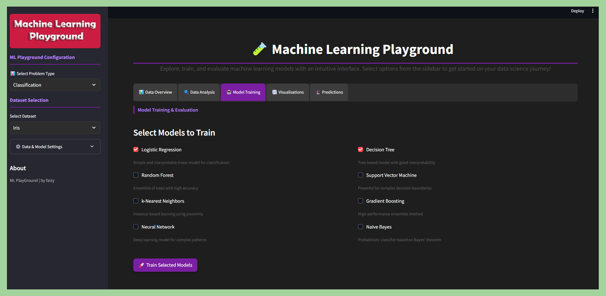

<div align="center">

# Machine-Learning-Playground

[**Demo**](#demo) |
[**Quick Start**](#quick-start) |
[**Features**](#features) |
[**Models & Datasets**](#models--datasets) |
[**File Structure**](#file-structure) |
[**License**](#license)


</div>

A full-stack, interactive machine learning playground built with **Streamlit**. Bridge the gap between theory and practice by exploring datasets, engineering features, training advanced models (XGBoost, LightGBM, CatBoost), and evaluating performance—all without writing code.

## demo

### ui preview

<a href="https://mohd-faizy-machine-learning-playground-main-khdhoj.streamlit.app/" target="_blank"></a>



### application workflow

1.  **Select Dataset & Problem Type** (Classification or Regression)
2.  **Choose ML Models** from scikit-learn
3.  **Train & Evaluate Models** using performance metrics
4.  **Compare Results & Make Predictions**

## quick start

```bash
git clone https://github.com/mohd-faizy/Machine-Learning-Playground.git
cd Machine-Learning-Playground

# using uv (recommended)
pip install uv
uv venv
source .venv/bin/activate  # or .venv\Scripts\activate on Windows
uv pip install -r requirements.txt

# run
streamlit run main.py
```

The application will launch at `http://localhost:8501`.

## features

- **Data**: Built-in datasets (Iris, Titanic, Penguins, Housing, etc.) + Custom CSV upload.
- **Preprocessing**: Robust scaling, missing value imputation, categorical encoding.
- **Feature Engineering**: PCA (2D/3D visualization), SelectKBest, Feature Importance.
- **Models**: Scikit-learn suite + Gradient Boosting (XGBoost, LightGBM, CatBoost).
- **Analysis**: Interactive Plotly/Seaborn charts, Correlation Heatmaps, Target Distribution.
- **Evaluation**: Confusion Matrix, ROC/AUC, Residuals, Learning Curves.

## models & datasets

| **Problem Type** | **Algorithms** | **Datasets** |
| :--- | :--- | :--- |
| **Classification** | Logistic Regression, Random Forest, SVM, k-NN, Naive Bayes, XGBoost, LightGBM, CatBoost | Iris, Titanic, Penguins, Breast Cancer, Wine, Digits |
| **Regression** | Linear Regression, Decision Tree, Random Forest, SVR, Gradient Boosting, MLP | Boston Housing, Diabetes, California Housing, Tips, Diamonds, Planets |

> **Note**: Custom CSV upload is supported for both problem types.

## file structure

```
Machine-Learning-Playground/
├── app/
│   ├── analysis.py    # visualization & metrics
│   ├── data.py        # loading & preprocessing
│   ├── features.py    # pca & selection
│   ├── models.py      # training logic
│   ├── ui.py          # streamlit config
│   └── utils.py       # helpers
├── assets/            # static resources
├── main.py            # entry point
└── requirements.txt   # dependencies
```

## license

MIT

## connect with me

<div align="center">

[](https://twitter.com/F4izy)
[](https://www.linkedin.com/in/mohd-faizy/)
[](https://ai.stackexchange.com/users/36737/faizy)
[](https://github.com/mohd-faizy)

</div>
